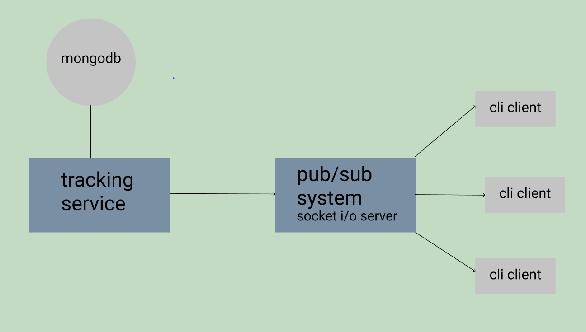

# Celtra backend assignment
Jaša Kšela ksela.jasa@gmail.com

This is visual presentation of our system. We have two seperate services (tracking-service and pub-sub-system) that communicate via websockets (socket.io). Tracking-service is rest api that supports following HTTP request **|GET /api/account/id?data="<<data>>"** . It is connected with mongodb. Pub-sub-system is socket.io server that publish the messages forward to subscribed clients (cli-client). 

## Technologies:
- **node.js**
- **typescript**
- **mongodb** with mongoose
- **socket.io** was used to create pub/sub system 

## Requirements
- npm
- mongodb

## Used ports
- 3000 - tracking-service
- 4000 - pub-sub-system

## Setup
1. For the best presentation of how our system works open three different terminals in the root directory of our project.

2. In the first terminal run
- cd tracking-service
- npm run create-db
- npm run build-start
3. In the second terminal run
- cd pub-sub-system
- npm run build-start
4. In the third terminal run
- cd cli-client
- npm install
- node client.js 1 2 

5. Now you can send http request. For example: http://localhost:3000/api/account/1?data="test"
6. If account with id 1 is active, then tracking-service will send message to pub-sub-system which will forward it to all subscribers.
7. You can open new clients from cli-client folder with  `node client.js 1 2 3` this for example would create new client who is subscribed to ids 1,2 and 3
8. Don't forget to drop database. In tracking-service run `npm run drop-db`

## Tests
In tracking-service run
- npm run build
- npm run tests